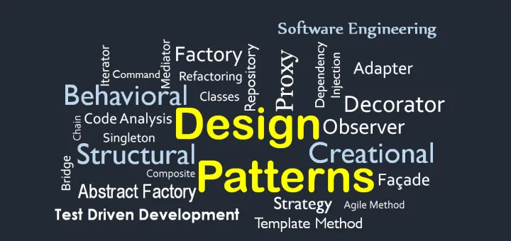

### Introduction

In software development, the concept of design patterns serves as a master blueprint book for an architect—a curated collection of solutions to common problems refined over time by many skilled engineers. These patterns provide a standardized approach to solving new design challenges, ensuring efficiency and reliability without reinventing the wheel with each project.

Imagine a city where each building represents a different software application. In this city, the architecture of the buildings—their blueprints and construction methodologies—reflect various design patterns. Some buildings are skyscrapers, towering and complex, similar to the 'Factory' pattern that abstracts the creation of objects. Others are like row houses resembling the 'Singleton' pattern, ensuring a single instance throughout the system.

### Meteor Framework

The Meteor framework stands out within this city like an innovative complex of interconnected buildings designed for specific climates. It uses a set of design patterns tailored to reactive applications that need to maintain a consistent state across client and server in real time. Meteor uses the 'Publish-Subscribe' pattern, a pivotal structure that enables real-time responsiveness. This pattern is like a central observatory within a building, where changes in the landscape (or data) are noticed instantly and communicated to all residents (clients), ensuring everyone is constantly updated.

### Reflection

In my own experience, I have constructed buildings in this metaphorical city. For example, on my Club Hub group project, we are creating a feature that allows Clubs to make announcements, and club members will receive that information on their home page. Thus, any data changes by one user will be immediately available to all others—a scenario appropriate for the 'Publish-Subscribe' pattern. By implementing this pattern, the application efficiently updates all users about changes without excessive server requests or data loading.

### Conclusion
In conclusion, design patterns are not merely theoretical concepts but are practical, tested solutions applied to the coding challenges that developers face daily. By understanding and utilizing these patterns, developers can ensure their software architecture is robust, scalable, and efficient. 
