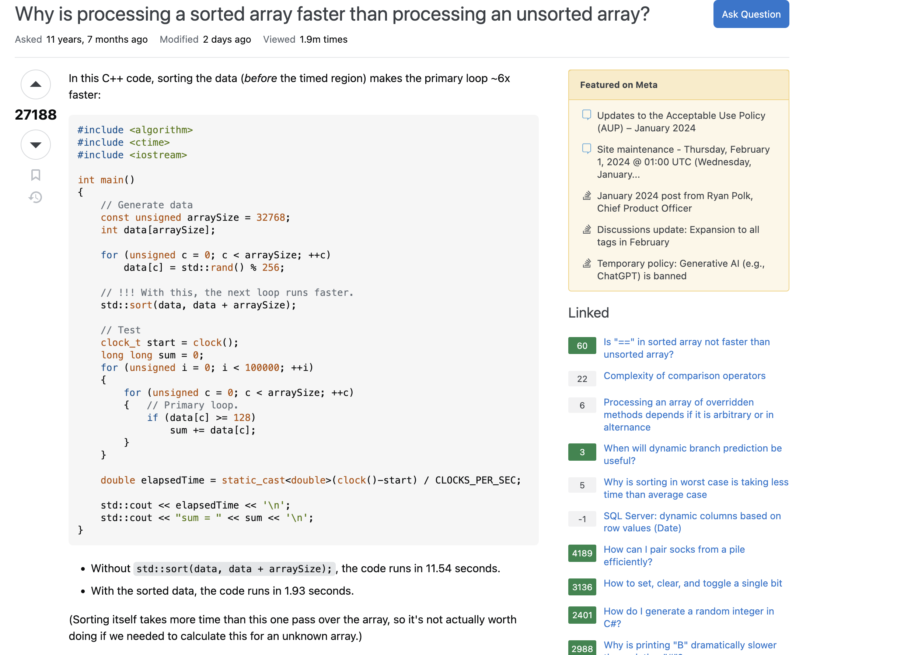

# How To Ask Questions The Smart Way

## Introduction
Effective communication is paramount in software engineering, and one crucial aspect of this skill is the ability to ask questions the "smart way," as outlined by Eric Raymond in his essay. This essay highlights the significance of asking smart questions on online public forums such as Stack Overflow with examples of following or not following Raymond's principles.

## Example 1: The Smart Way
URL: [Why is processing a sorted array faster than processing an unsorted array?](https://stackoverflow.com/questions/11227809/why-is-processing-a-sorted-array-faster-than-processing-an-unsorted-array)

### Summary
In this example, a developer demonstrates the smart way of asking questions by adhering to the guidelines established by Eric Raymond. The question is clear, concise, and provides context, including relevant details such as the programming language and the specific issue encountered. The community's responses are constructive, addressing the problem systematically, offering insights, and providing solutions. This example exemplifies how asking a smart question on StackOverflow can lead to efficient and effective assistance from the community.

## Example 2: The Not So Smart Way
URL: [SALE Entry Form](https://stackoverflow.com/questions/77884673/sale-entry-form)

### Summary
Conversely, the not-so-smart question showcases a developer failing to follow the principles set by Raymond. The submission lacked crucial information, research effort, and context for the issue. The request was for an entire program in SQL and C#, which is not the intended purpose of the forum. Consequently, the submission was downvoted, and the community did not respond. This example illustrates how the community will not support requests for an entire program.

## Conclusion
In conclusion, the ability to ask smart questions is a critical aspect of effective communication in software engineering. The examples from StackOverflow illustrate the tangible impact of following or neglecting the guidelines set by Eric Raymond. By understanding the principles of asking smart questions, software engineers can enhance their communication skills, contribute to a positive community environment, and receive more efficient and effective assistance.
