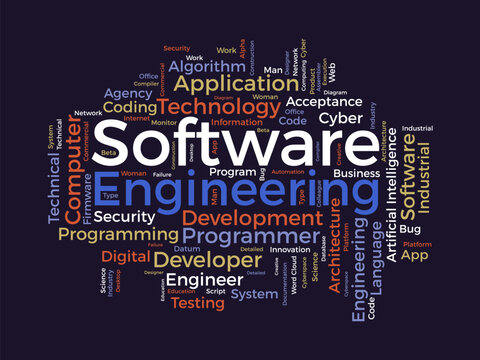

# Introduction
While the web development tools in this class provided a practical foundation, there are also broader software engineering concepts we explored. Agile project management, coding standards, and development environments are the three concepts that extend far beyond web applications. Whether in a software engineering role or another technical role, these concepts are common and can be applied to various tasks or projects. 

# Agile Project Management
Agile Project Management, particularly the Issue Driven Project Management (IDPM) style, was a pivotal aspect of our coursework. Traditional project management often operates on rigid, linear timelines and fixed scopes, leading to significant challenges in adapting to changes. In contrast, Agile encourages continuous iteration and feedback, focusing on flexible responses to change and iterative development.

IDPM, a subset of Agile practices, revolves around creating, prioritizing, and resolving issues that act as the central workflow for project tasks. This method emphasizes transparency and adaptability, traits crucial for fast-paced and unpredictable project environments. The applicability of IDPM extends beyond web applications to any project that benefits from iterative feedback and adaptive planning. 

# Coding Standards
Another key takeaway was the importance of coding standards. These establish guidelines for formatting, naming conventions, and commenting code. While this may seem minor in a single project, consistent coding standards become crucial in larger codebases or collaborative environments. Imagine a house built by different teams, each with their way of framing walls or laying bricks. The resulting structure would be chaotic and challenging to maintain. Beyond web development, coding standards ensure our code is like a well-built house – consistent, understandable, and more accessible to modify or troubleshoot in the future, regardless of who wrote it.

# Development Environments 
Development environments (DEs) also exceed the web development realm. A DE provides a platform for writing, compiling, debugging, and testing code. While the specific features may vary depending on the programming language, the core principles apply to any software development project. Learning to navigate a DE effectively translates to any coding endeavor, allowing you to write clean, efficient code and quickly identify errors. These skills are fundamental to becoming a well-rounded software engineer.

# Conclusion
Reflecting on these topics has broadened my understanding of software engineering as a discipline that extends well beyond the confines of web application development. The concepts learned are not only about how to code or use specific tools but also how to think critically, collaborate effectively, and act ethically. This class has equipped me with a versatile toolkit that I can apply in various contexts, ensuring that I am a competent software developer and a well-rounded software engineer. Through this reflection, I appreciate the depth and breadth of software engineering, and I am ready to apply these fundamental principles wherever my career might lead.
