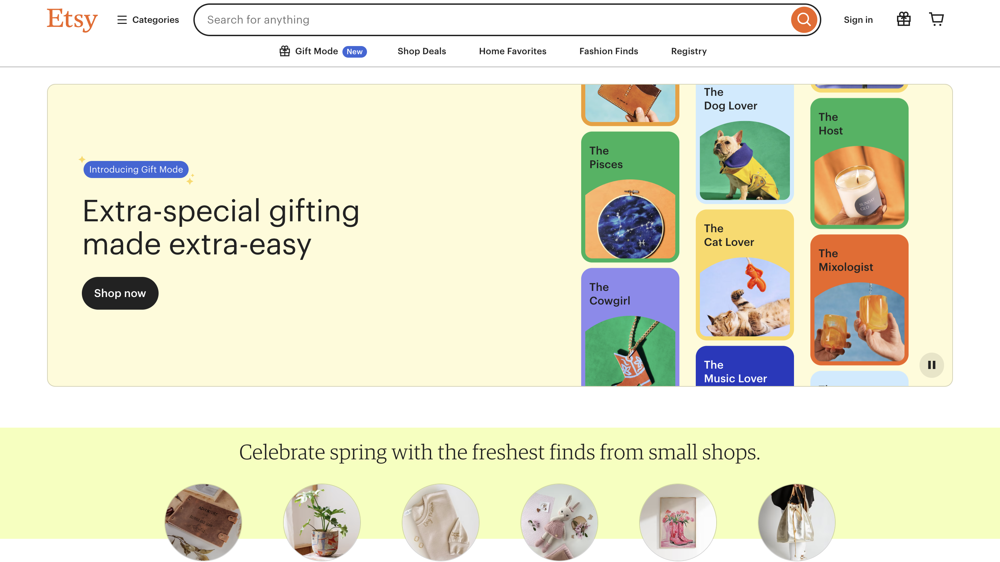
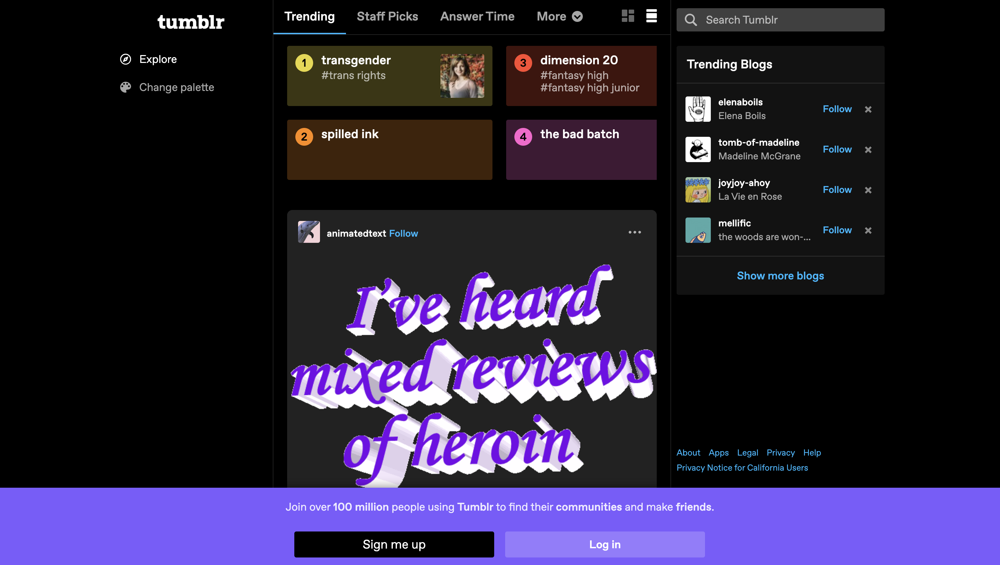

## Introduction
The UI framework comprises pre-built code, components, libraries, and design elements, all tailored for software development to craft user interfaces. These versatile elements, including buttons, icons, forms, menus, and layout templates, are readily adaptable for use. Prominent UI frameworks like Bootstrap, Semantic UI, React, and Ext JS UI offer comprehensive libraries and components, enhancing consistency across projects and streamlining the development process. However, learning these frameworks can feel similar to learning a new programming language. This essay delves into the purpose of utilizing UI frameworks, such as Bootstrap 5, highlighting their advantages and significance in contemporary web development.

## Investment Vs Return
The question arises: why invest time and effort into learning and utilizing UI frameworks when raw HTML and CSS suffice? The answer lies in efficiency, consistency, and scalability. By leveraging a UI framework like Bootstrap 5, developers gain access to an integrated set of design patterns and components, reducing development time and ensuring a consistent look and feel across their projects. Moreover, frameworks often come equipped with robust documentation and community support, easing the learning curve and fostering collaboration.

## Software Engineering Benefits
Beyond aesthetics, UI frameworks provide an abundance of software engineering advantages. They promote the use of modular development techniques, which make it simple for developers to encapsulate and reuse components. This modular design improves scalability and maintainability since modifications made to one component affect the entire application at once. In addition, frameworks usually include best practices for responsive design, accessibility, and performance optimization, enabling developers to easily create an effective online experiences.

## Personal Reflection: Bootstrap 5
Having worked with both Bootstrap 5 UI, I've gained valuable insights into the respective advantages and disadvantages. An advantage of Bootstrap 5 is that it has a strong community and a large ecosystem of plugins; however, this could also be a disadvantage. As Bootstrap is known to be feature-rich, it may not be the best choice if one is aiming to create a simple website.  
Ultimately, the choice between frameworks often boils down to project requirements and personal preference.

## Conclusion
Even though UI frameworks have a steep learning curve, the benefits they provide exceeds the initial difficulties. Building modern, responsive, and accessible online apps is made easier for developers with the help of frameworks like Bootstrap 5, which offers improved software engineering techniques and speedier development workflows. Adopting UI frameworks is a an essential part toward efficiency and innovation as we continue to navigate the dynamic field of web development.

## Example of a website that uses Bootstrap
### Etsy

URL: [Etsy](https://www.etsy.com/)

## Example of a website that does not use Bootstrap
### Tumblr

URL: [Tumblr](https://www.tumblr.com/)

