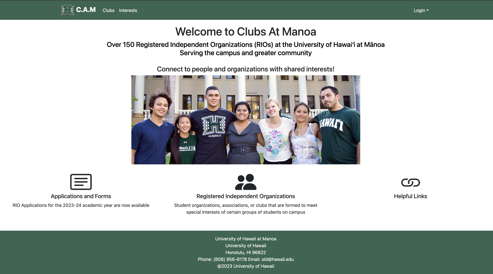
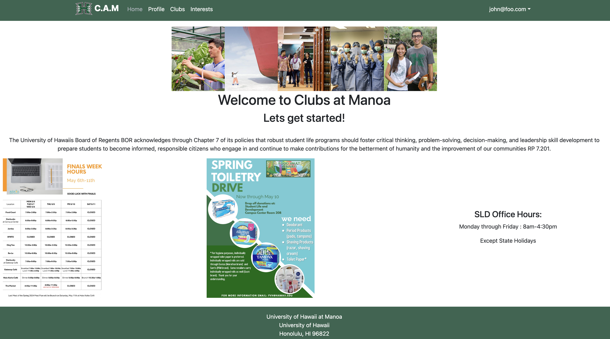
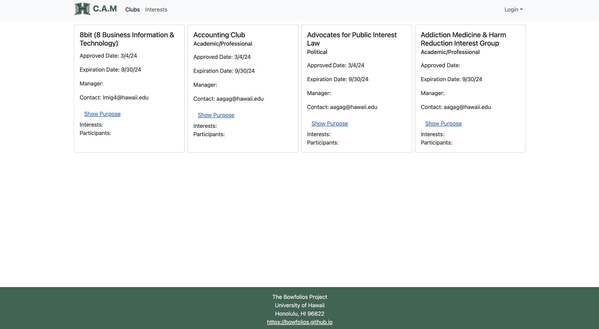

### Overview

This project was a group effort, made up of a total of five people. We were given a problem and a guideline for a solution. The goal was to develop a minimum viable product (MVP) that could be used within the UHM community.

### The problem 

UH Manoa has over 200 Registered Independent Organizations, plus many more that do not have this “official” status but are nonetheless active organizations. Unfortunately, there is no easy way for students to learn (a) what student clubs (both registered and unregistered) exist, what they do, and how to get further involved.

### The solution 

The Clubs At Manoa application will provide a centralized directory for UH Manoa student clubs. UH Manoa students can login to browse a well organized directory of all current student clubs, with brief descriptions, meeting times and locations, URLs to their websites (if any), contact information for officers, and a few select photos.

### MVP

Clubs at Manoa provides a solid foundation toward achieving the desired solution. It represents an improvement over the original process, which involved searching through a CSV file. The major components of this app offer a streamlined process for students to search for clubs based on their interests and connect with the UHM community.

  
  
  

### My Contributions
In this group project, I ensured the completeness of information on the organization page for milestones 2 and 3 (M2, M3). Additionally, I helped create and maintain the project and team capacity boards on GitHub, which facilitated efficient task tracking and effort allocation. Beyond that, I took ownership of designing the landing and home pages and populating default data.

My commitment extended beyond assigned tasks. I actively fostered collaboration by making myself available for discussions in and outside class. When we encountered challenges, I actively participated in troubleshooting and researching solutions. I'm also enthusiastic about contributing to the extra credit opportunity.

### Lessons Learned
This project provided valuable lessons beyond technical skills. I underestimated the importance of seemingly trivial tasks like communication and coordination. In hindsight, a preliminary discussion to establish a clear workflow would have significantly streamlined the process. The project also deepened my understanding of the software development lifecycle and the practical application of concepts learned earlier in the course.

[Clubs At Manoa Team GitHub](https://clubs-at-manoa.github.io/)

