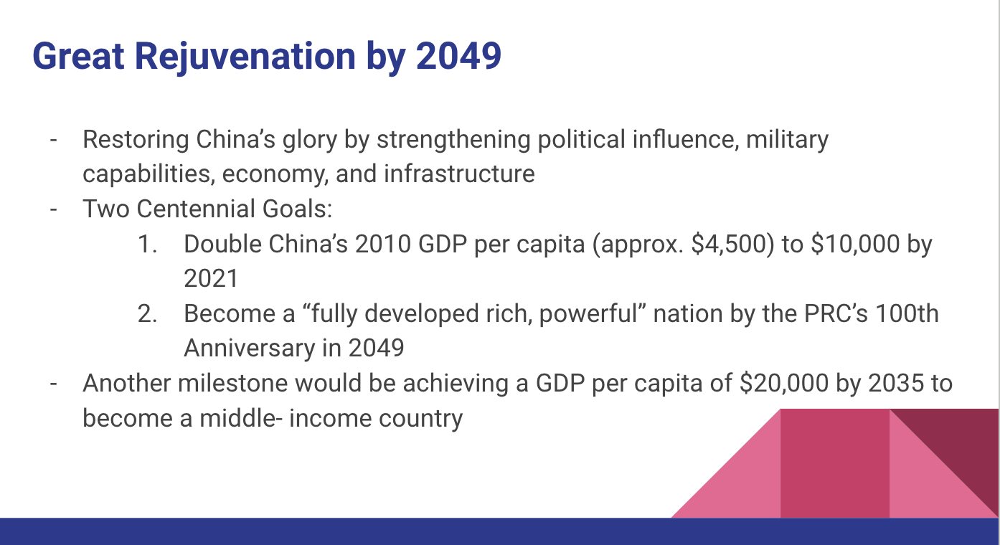
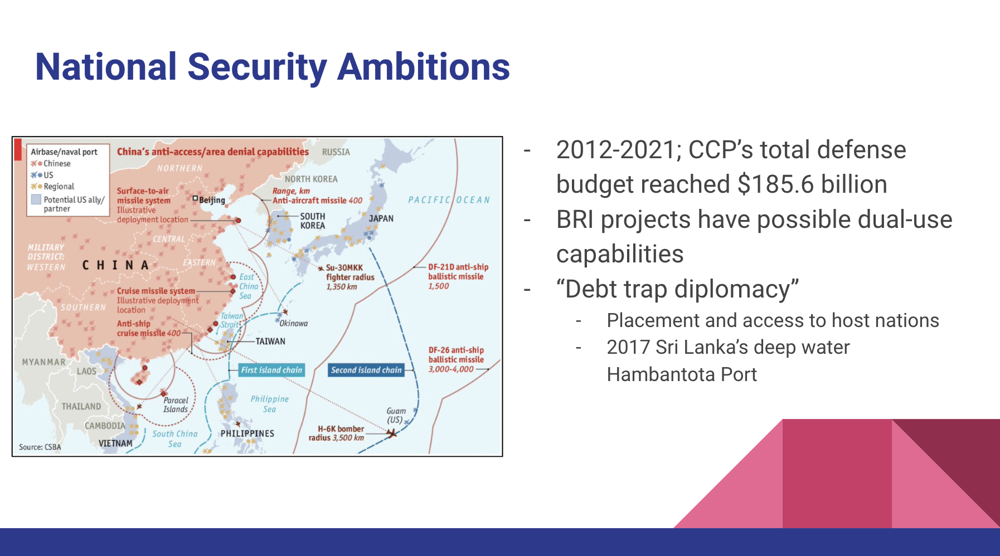

# Introduction to the project
A few crucial skills for any intelligence professional include the ability to synthesize large quantities of research/information, formulate an objective story from the information, explain the story and key research findings to senior officials, and offer recommendations for using intelligence in executive decisions. This project involved creating a research paper and delivering a presentation tailored for senior executives to inform hypothetical decisions. The research topic was to assess China’s growing economy and national security ambitions. I have included the introduction to my research paper and the slides from my presentation.

# Assessing China’s Growing Economy and National Security Ambitions
Over the century, the Chinese Communist Party (CCP) and its leaders transformed China’s economy allowing China to become a key strategic competitor in global affairs. China’s growth over time has demonstrated its resiliency and flexibility to adapt to the economic challenges of the traditional role of the communist party. Since the introduction of capitalism, there has been exponential growth that is closing the gap in gross domestic product (GDP) between China and the United States. If China continues to meet or exceed its economic expectations, it will be able to execute infrastructure goals which support its national security ambitions, posing a threat to regional and global security.

  
  
  

