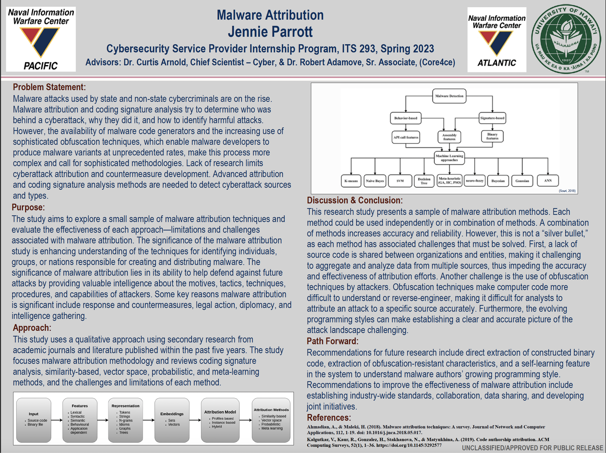

This project delves into the critical domain of malware attribution, specifically focusing on methods for identifying and attributing cyber threats. Motivated by a broader interest in malware analysis, the research aims to offer a comprehensive overview of attribution techniques. Each method explored can stand alone or be combined strategically, enhancing accuracy and reliability. However, the absence of shared source code among entities and the use of obfuscation techniques by attackers present persistent challenges. These hurdles underscore the complexity of accurately attributing attacks, emphasizing the need for continual innovation in cybersecurity practices.

In this dynamic landscape, the study not only exposes these challenges but also highlights the importance of addressing them. As we navigate the intricate web of malware attribution, this research contributes valuable insights, recognizing the multifaceted nature of the obstacles faced and underscoring the imperative for ongoing advancements in cybersecurity methodologies.

